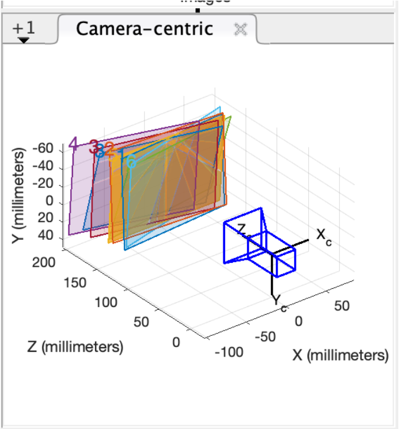
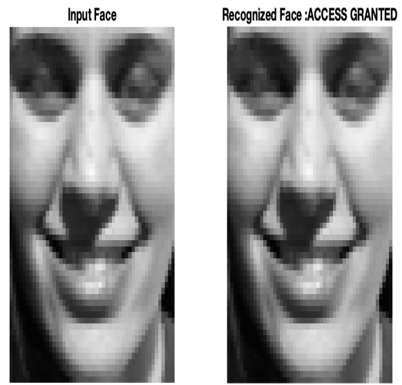
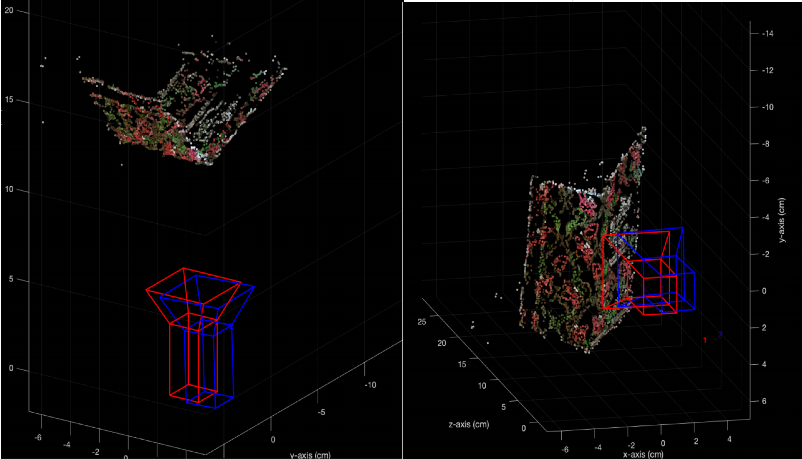

# Computer_vision

- This Computer vision and robot vision  course work was developed using matlab.
- It mainly focuses about 3D reconstruction and Face Recognition.

## Face Recgnition 

One major problem of images is as it has many pixels it is computationally expensive. Therefore dimensionality reduction technique like Principal Component Analysis(PCA) or Convolutional Neural Network(CNN) are crucial to tackle this pitfall. The face recognition here is developed using PCA. 
- Transform the image of bitmap inputs which are considered as training inputs  to different dimension vectors 
- Apply PCA for these transformed inputs
- Select the top eigenvectors which is called eigenfaces  by comparing the eigenvalues 
- Faces are projected from combination of these eigenfaces and mean 
- Recognition is  done by comparing the projected image and original known using Euclidean distance to measure similarity
- Add the convenient  threshold value to identify the given image as recognized or not
- This approach over other face recognition system is because of its simplicity, speed and insensitivity to small or gradual changes of faces. 

The following figure shows how the developed face recognition system can identify the input image and be able to recognise it to give access. Which is useful for security systems. 

<!--  -->

## 3D construction
The second part of this work is to construct 3d from multiple 2d images.
- This needs camera calibration as first step to identify intrissic andextrinsic parameters
- Depth determination to calculate the 3D components  and other steps followed as shown from the given matlap implementation
The following figure shows the  constructed  3D

